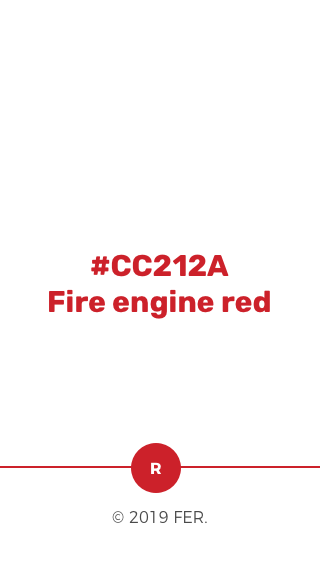
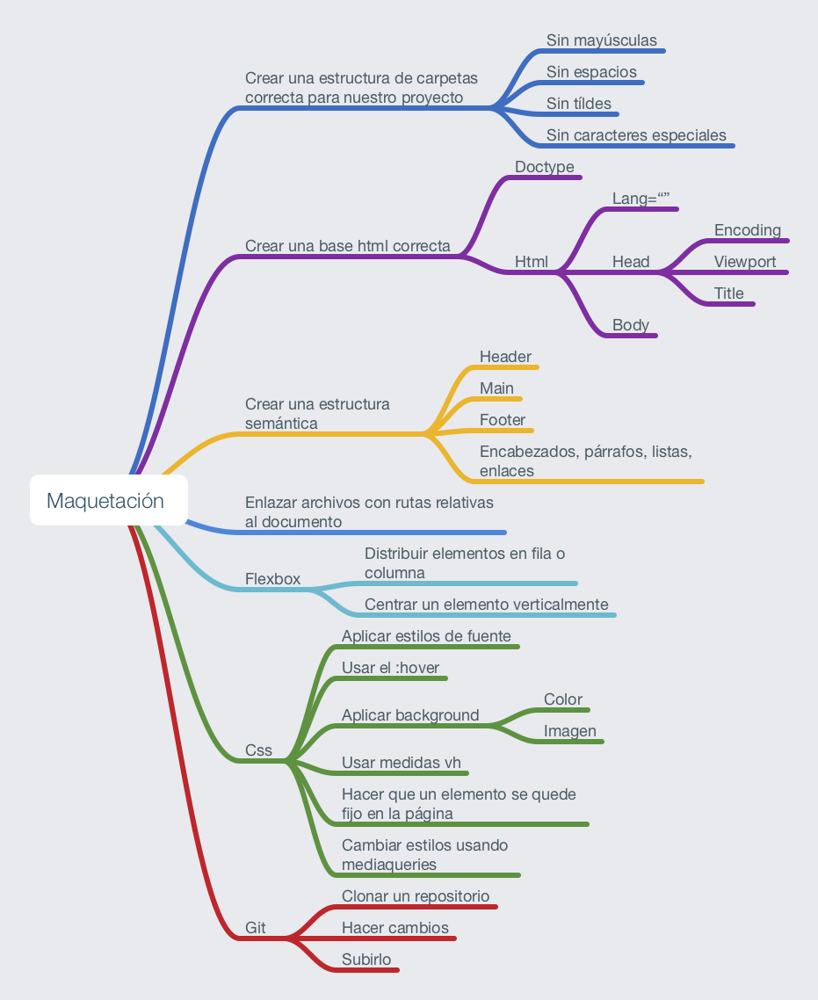

# Repaso intermedio módulo 1

## Ejercicio de repaso

Dadas estas pantallas, vamos a realizar la maquetación responsive.

> Versión mobile

> Versión tablet/desktop

## Resumen del módulo

## Librerías

- [Google fonts](https://fonts.google.com/)
